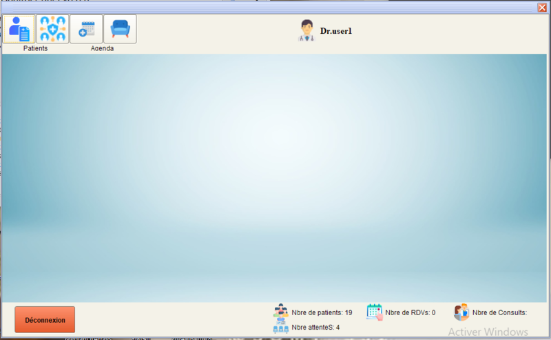

Sure! Here's a draft README for your medical office management software project using NetBeans and Java:

---

# Logiciel de Gestion de Cabinet Médical

Bienvenue dans le projet Logiciel de Gestion de Cabinet Médical ! Ce projet est une application de bureau développée en Java avec NetBeans pour gérer efficacement les opérations d'un cabinet médical.

## Table des Matières

- [Introduction](#introduction)
- [Fonctionnalités](#fonctionnalités)
- [Technologies Utilisées](#technologies-utilisées)
- [Installation](#installation)
- [Utilisation](#utilisation)
- [Captures d'Écran](#captures-d'écran)
- [Contribuer](#contribuer)


## Introduction

Le Logiciel de Gestion de Cabinet Médical est conçu pour faciliter la gestion quotidienne d'un cabinet médical. Il permet de gérer les patients, les rendez-vous, les dossiers médicaux, la facturation, et bien plus encore.

## Fonctionnalités

- **Gestion des Patients** : Ajouter, modifier et supprimer des informations sur les patients.
- **Gestion des Rendez-vous** : Planifier, modifier et annuler des rendez-vous.
- **Dossiers Médicaux** : Accéder et mettre à jour les dossiers médicaux des patients.
- **Ordonnances** : Générer et gérer les ordonnaces des consultations et traitements.
  

## Technologies Utilisées

- **Langage de Programmation** : Java
- **IDE** : NetBeans
- **Base de Données** : MySQL
- **Bibliothèques** : JDBC, Swing

## Installation

### Prérequis

Avant de commencer, assurez-vous d'avoir les éléments suivants installés :

- [Java Development Kit (JDK)](https://www.oracle.com/java/technologies/javase-downloads.html)
- [NetBeans IDE](https://netbeans.apache.org/download/index.html)
- [MySQL](https://www.mysql.com/)

### Étapes d'Installation

1. **Cloner le Répertoire**

   ```bash
   git clone https://github.com/NaimiNour/doctor-java.git
   cd doctor-java
   ```

2. **Configurer la Base de Données**

   - Créez une base de données MySQL et importez le fichier `schema.sql` fourni dans le répertoire du projet pour configurer les tables nécessaires.

3. **Configurer les Variables d'Environnement**

   - Créez un fichier `.env` dans le répertoire racine et ajoutez les détails de votre base de données :

     ```
     DB_URL=jdbc:mysql://localhost:3306/nom_de_votre_base_de_données
     DB_USERNAME="root"
     DB_PASSWORD=""
     ```

4. **Ouvrir le Projet dans NetBeans**

   - Lancez NetBeans et ouvrez le projet en sélectionnant le répertoire cloné.

5. **Exécuter l'Application**

   - Cliquez sur "Run" dans NetBeans pour compiler et exécuter l'application.

## Utilisation

### Lancer l'Application

Une fois l'application lancée, vous serez accueilli par l'écran de connexion. Connectez-vous avec vos informations d'identification.

### Interface Principale

- **Menu** : Vue d'ensemble des opérations du jour.
- **Gestion des Patients** : Ajouter, modifier et supprimer.
- **Rendez-vous** : Gérer les rendez-vous des patients.
- **Statistiques** : Nombres de patients, RDV jour j, patients dans la salle d'attente, consultations...

## Captures d'Écran

### Tableau de Bord




## Contribuer

Les contributions sont les bienvenues ! Veuillez suivre ces étapes pour contribuer :

1. Forker le dépôt.
2. Créer une nouvelle branche (`git checkout -b feature/nom-de-la-fonctionnalité`).
3. Apporter vos modifications et les valider (`git commit -m 'Ajouter une nouvelle fonctionnalité'`).
4. Pousser vers la branche (`git push origin feature/nom-de-la-fonctionnalité`).
5. Ouvrir une Pull Request.

